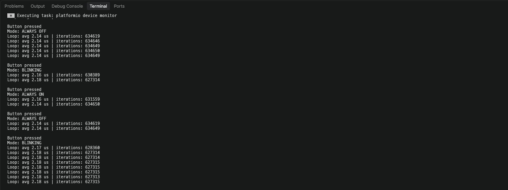

# Embedded Development — домашнє завдання 02.10.2026

Проєкт для ESP32-S3 на Arduino / PlatformIO: перемикання режимів LED кнопкою та вимірювання середнього часу виконання superloop.

## Результат роботи

Вивід Serial Monitor: перемикання режимів `BLINKING`, `ALWAYS ON`, `ALWAYS OFF` і статистика виконання циклу.

